# MissChecker - Cosmetic safety chatbot

> AI-powered chatbot that analyzes cosmetic ingredient safety using evidence-based research and medical literature.


## Features

- **Evidence-Based Analysis**: Queries 7 specialized PDF documents about cosmetic safety.
- **Real-Time Responses**: Powered by AWS Bedrock with Titan Text Embeddings v2.
- **Smart Safety Recommendations**: Identifies harmful ingredients and suggests alternatives.
- **Mobile-First Design**: Responsive interface with pastel color palette.
- **Secure API**: API key protection via Netlify Functions.
- **Contextual Chat**: RAG (Retrieval-Augmented Generation) for accurate responses.

## Architecture

### High-Level Flow
```
User Query → Website → Netlify Function → API Gateway → Lambda → Bedrock Knowledge Base → S3 PDFs
    ↓                                                                         ↑
Response ← Website ← Netlify Function ← API Gateway ← Lambda ← Titan Text Embeddings v2 ←

```


### Tech Stack
- **Frontend**: Vanilla JavaScript, HTML5, CSS3.
- **Backend**: AWS Lambda (Python), Bedrock Knowledge Base.
- **Database**: S3 Vector Store with 7 cosmetic safety PDFs.
- **API**: AWS API Gateway with API key authentication.
- **Deployment**: Netlify (Frontend + Serverless Functions)
- **AI Model**: Amazon Bedrock - Titan Text Embeddings v2.

## Quick Start

### Prerequisites
- AWS Account with Bedrock access.
- Netlify account.
- 7 PDF documents about cosmetic ingredient safety.

### Deployment

1. **Clone Repository**
```bash
git clone https://github.com/zaidiaz23/misschecker
cd misschecker
```

2. **AWS Setup**
```bash
# Create S3 bucket for knowledge base
aws s3 mb s3://medicheck-knowledge-base-your-id

# Upload PDFs to documents folder
aws s3 cp your-pdfs/ s3://medicheck-knowledge-base-your-id/documents/ --recursive
```

3. **Configure AWS Services**
- Enable Bedrock models (Claude 3 Sonnet, Titan Embeddings)
- Create Knowledge Base with S3 vector store
- Set up Lambda function with provided code
- Configure API Gateway with API key

4. **Deploy to Netlify**
```bash
# Set environment variables in Netlify
AWS_API_GATEWAY_URL=https://your-api.execute-api.region.amazonaws.com/prod/chat
AWS_API_KEY=your-api-key

# Deploy via Git or drag & drop
```

## Project Structure

```
medicheck-chatbot/
├── 📄 index.html              # Main website
├── 🎨 styles.css              # Pastel design system
├── ⚡ script.js              # Frontend chatbot logic
├── 📦 package.json           # Dependencies
├── 🔧 netlify/
│   └── functions/
│       └── chat.js           # Serverless function (API proxy)
├── ☁️ aws/
│   └── lambda_function.py    # AWS Lambda RAG processor
└── 📚 documents/             # PDF knowledge base (7 files)
    ├── chemicals-cancer.pdf
    ├── fragrance-safety.pdf
    └── ... (5 more PDFs)
```

## Key Workflows

### 1. **Knowledge Base Creation**


### 2. **Query Processing Flow**


### 3. **Response Enhancement**

```mermaid
graph TD
    A[Raw Titan Text Embeddings v2] --> B[Frontend formatting]
    B --> C[Smart truncation ≤368 chars]
    C --> D[Highlight safety terms]
    D --> E[Display to user]
```


## Environment Variables

### Netlify Environment Variables
```env
AWS_API_GATEWAY_URL=https://your-api-id.execute-api.us-east-1.amazonaws.com/prod/chat
AWS_API_KEY=your-api-key-from-aws-console
```

### Lambda Environment Variables
```env
KNOWLEDGE_BASE_ID=your-kb-id-from-bedrock
S3_BUCKET_NAME=medicheck-knowledge-base-your-id
```

## 📊 Performance

- **Response Time**: 3-8 seconds average
- **Token Limit**: 180 tokens (~400-500 characters)
- **Character Limit**: 368 characters (frontend truncated)
- **Accuracy**: High (semantic search + medical literature)
- **Uptime**: 99.9% (AWS + Netlify SLA)

## Security Features

- ✅ API key authentication
- ✅ CORS protection
- ✅ Input validation & sanitization  
- ✅ Environment variable isolation
- ✅ No sensitive data in frontend
- ✅ Serverless proxy pattern

## Use Cases

- **Consumers**: Check ingredient safety before purchasing cosmetics
- **Parents**: Verify children's product ingredients
- **Sensitive Skin**: Find suitable alternatives for problematic ingredients
- **Health Conscious**: Make informed beauty product decisions
- **Pregnant Women**: Identify ingredients to avoid during pregnancy

---

**⚠️ Disclaimer**: This tool provides educational information only. Always consult healthcare professionals for medical advice and product recommendations.
